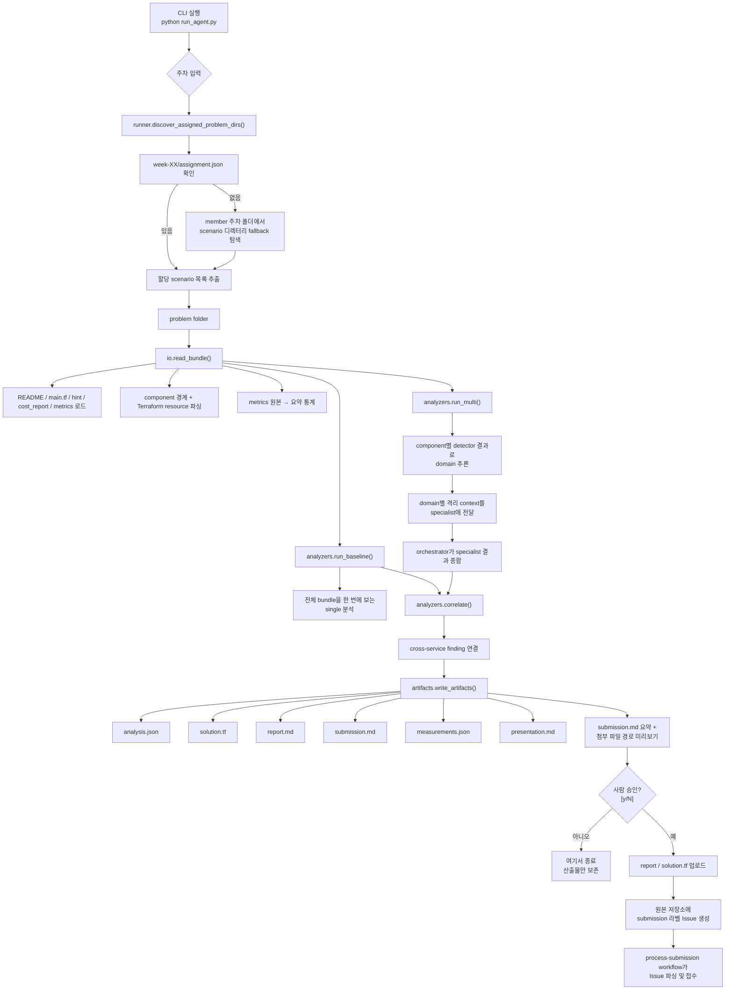

# 주간 FinOps Agent

이 문서는 `09th-cloud-diet` 스터디에서 매주 주어지는 클라우드 비용 최적화 문제를 자동으로 분석·해결해 주는 CLI 도구의 공식 설명서다. FinOps를 처음 접하는 사람도 따라올 수 있도록, 먼저 배경과 용어를 설명한 뒤 도구의 동작을 단계별로 풀어 쓴다.

## 목차

- [먼저 알아두면 좋은 용어](#먼저-알아두면-좋은-용어)
- [현재 구현 요약 (빠른 시작)](#현재-구현-요약-빠른-시작)
- [실행 흐름](#실행-흐름)
  - [플로우 줄글 설명](#플로우-줄글-설명)
- [모듈별 역할](#모듈별-역할)
- [입력을 어떻게 사용하나](#입력을-어떻게-사용하나)
- [single과 multi는 실제로 무엇이 다른가](#single과-multi는-실제로-무엇이-다른가)
- [측정값 해석](#측정값-해석)
- [현재 detector 범위](#현재-detector-범위)
- [산출물은 어떻게 만들어지나](#산출물은-어떻게-만들어지나)
- [제출은 어떻게 이뤄지나](#제출은-어떻게-이뤄지나)
- [XS-005 현재 결과](#xs-005-현재-결과)
- [검증 상태](#검증-상태)
- [현재 한계와 다음 확장](#현재-한계와-다음-확장)

## 먼저 알아두면 좋은 용어

이 문서 전체에서 반복해서 나오는 용어들이다. 처음 보는 단어가 있으면 여기로 돌아오면 된다.

| 용어 | 쉬운 설명 |
| --- | --- |
| **scenario / 문제** | 분석 대상 한 세트. 인프라 코드·지표·비용 리포트가 한 폴더에 담겨 있다. `XS-005` 같은 ID가 붙는다 |
| **Terraform / `main.tf`** | 클라우드 인프라를 글(코드)로 적어 두는 도구. `main.tf`가 그 코드 파일이다 |
| **resource / 리소스** | 인프라를 이루는 개별 부품. 데이터베이스 1개, 함수 1개가 각각 하나의 리소스다 |
| **component / 컴포넌트** | 관련 있는 리소스를 묶은 덩어리. `main.tf` 안 주석으로 경계가 표시돼 있다 |
| **metrics / 지표** | 리소스가 실제로 얼마나 쓰였는지 보여주는 측정값(트래픽량 등) |
| **detector / 탐지기** | "이런 모양이면 낭비다"라는 규칙 하나. 예: "개발용 DB인데 이중화가 켜져 있다" |
| **finding / 발견 항목** | detector가 실제로 찾아낸 낭비 한 건 |
| **pattern / 패턴 (`L1-004` 등)** | 낭비 유형에 붙인 표준 ID. 앞의 `L1·L2·L3`는 단계로, 숫자가 클수록 여러 서비스가 얽힌 복합 문제다 |
| **NAT / cross-AZ** | 클라우드 네트워크 부품. 데이터가 NAT를 지나가거나 가용영역(AZ)을 건너가면 그만큼 요금이 붙어 낭비 원인이 된다 |
| **provider / LLM** | 분석에 쓰는 AI 모델. `local`은 모델 없이 규칙만 돌리고, `openai`·`claude`는 실제 모델을 호출한다 |
| **recall / 재현율** | 실제로 존재하는 낭비 중 몇 %를 찾아냈는지를 뜻하는 지표 |

## 현재 구현 요약 (빠른 시작)

주차만 입력하면, 입력 로드부터 진단·단일/멀티 비교·사람 승인 후 실제 제출까지 한 번에 수행하는 CLI 파이프라인이다.

```bash
python run_agent.py
# 분석할 주차를 입력하세요 (예: 3): 3
```

따로 지정하지 않으면 아래 기본값으로 동작한다.

- `--mode compare` — 단일/멀티 분석을 둘 다 돌려 비교한다
- `--provider local` — AI 모델 호출 없이 규칙 기반으로만 분석한다
- `--member jud1thDev` — 문제를 찾을 멤버 ID
- `--season 2` — 시즌 번호
- 출력 위치는 자동으로 정해진다: `members/jud1thDev/season-2/submissions/week-XX/<SCENARIO>/`

질문 없이 한 번에 돌리고 싶으면 주차를 인자로 직접 넘긴다.

```bash
python run_agent.py --week 3
```

실행이 끝나면 아래 산출물이 자동으로 만들어진다. 각각이 무엇인지는 [산출물은 어떻게 만들어지나](#산출물은-어떻게-만들어지나)에서 설명한다.

- `analysis.json`
- `solution.tf`
- `report.md`
- `submission.md`
- `measurements.json`
- `presentation.md`

제출 직전에는 반드시 사람이 한 번 승인해야 하며, 기본값은 "제출 안 함"이다.

```text
원본 저장소에 지금 제출할까요? [y/N]:
```

## 실행 흐름

아래 그림은 도구가 한 번 실행될 때 거치는 전체 과정이다. 그림이 익숙하지 않다면 바로 아래 [플로우 줄글 설명](#플로우-줄글-설명)을 먼저 읽어도 된다.



### 플로우 줄글 설명

발표 때 위 그림을 따라가며 설명하면 다음과 같다.

**1단계 — 실행과 주차 입력.** 시작은 `python run_agent.py` 한 줄이다. 실행하면 에이전트가 "분석할 주차를 입력하세요"라고 묻고, 발표자는 주차 번호 하나만 넣는다. 비대화형으로 돌릴 때는 `--week 3`처럼 인자로 바로 넘긴다. 즉 사람이 직접 주는 정보는 주차 하나뿐이고, 경로·멤버·시즌·모드는 모두 기본값으로 자동 결정된다.

**2단계 — 할당 문제 탐색.** 주차가 정해지면 `runner.discover_assigned_problem_dirs()`가 그 주차에 내가 풀어야 할 문제를 찾는다. 먼저 `members/<member>/season-<n>/problems/week-XX/assignment.json`을 확인하고, 파일이 있으면 거기 적힌 scenario 목록을 그대로 가져온다. 파일이 없으면 멤버의 주차 폴더 안에 있는 scenario 디렉터리를 직접 훑어 fallback으로 목록을 만든다. 어느 경로든 결과는 "이번에 풀 problem folder 목록"이다.

**3단계 — 입력 번들 로드.** 문제 폴더가 정해지면 `io.read_bundle()`이 폴더 안 파일만 읽어 입력을 구성한다. 이때 세 가지를 한다. 첫째, README·main.tf·hint·cost_report·metrics를 로드한다. 둘째, main.tf를 파싱해 component 경계와 Terraform resource를 분리한다. 셋째, metrics 원본을 요약 통계로 압축한다. 핵심은 에이전트가 문제 폴더 바깥 파일은 절대 읽지 않는다는 점이다.

**4단계 — 두 갈래 분석.** 번들이 준비되면 분석이 두 경로로 나뉜다. `analyzers.run_baseline()`는 single 분석으로, 전체 번들(README·Terraform·metrics·cost 전체)을 한 번에 보고 finding을 만든다. `analyzers.run_multi()`는 multi 분석으로, component별 detector 결과에서 domain(네트워크·스토리지·컴퓨트 등)을 추론하고, domain별로 격리한 context를 specialist에게 넘긴 뒤 orchestrator가 그 결과를 종합한다. 두 경로는 같은 detector registry를 쓰므로 local 모드에서는 finding이 같을 수 있다 — 차이는 탐지력이 아니라 컨텍스트를 어떻게 쪼개느냐다.

**5단계 — Cross-service correlation.** single 결과와 multi 종합 결과는 `analyzers.correlate()`로 모인다. 여기서 서로 다른 서비스에 흩어진 finding을 연결해 결합 원인을 만든다. 현재 등록된 결합 규칙은 세 가지다 — `L3-029`+`L3-025`(S3 트래픽↔NAT 경로), `L2-014`+`L1-011`(캐시 부재가 Lambda·S3 비용을 동반 증폭), `L2-014`+`L2-015`+`L1-010`(재시도 루프가 서버리스·DB 비용을 증폭). XS-005가 대표 사례로, `L3-029`(S3 트래픽이 중앙 NAT를 통과)와 `L3-025`(cross-AZ 전송)를 연결해 "S3 대량 트래픽 → 중앙 NAT → NAT 처리비 + cross-AZ 전송비"라는 emergent finding을 만든다.

**6단계 — 산출물 생성.** correlation까지 끝나면 `artifacts.write_artifacts()`가 제출물 여섯 개를 한 번에 쓴다 — `analysis.json`, `solution.tf`, `report.md`, `submission.md`, `measurements.json`, `presentation.md`. 여기서 `solution.tf`는 단순 주석이 아니라 실제 리소스 수정안이고, `measurements.json`은 token·context 측정값을 담는다.

**7단계 — 제출 미리보기와 사람 승인.** 산출물이 만들어져도 에이전트는 곧바로 제출하지 않는다. `submission.md` 요약과 첨부 파일 경로를 미리보기로 출력한 뒤 "원본 저장소에 지금 제출할까요? [y/N]"을 묻고, 기본값은 `N`이다. 사람이 거절하면 거기서 종료하고 만들어진 산출물만 로컬에 남긴다. 사람이 `y`를 명시적으로 입력해야만 다음 단계로 넘어간다.

**8단계 — 실제 제출.** 승인되면 `report`와 `solution.tf`를 멤버 submissions 경로에 업로드하고, 원본 저장소 `cloud-club/09th-cloud-diet`에 `submission` 라벨이 붙은 GitHub Issue를 생성한다. 마지막으로 저장소의 `process-submission` workflow가 그 Issue를 감지해 파싱하고 접수한다. 여기까지가 한 번 실행의 전체 흐름이다.

## 모듈별 역할

이 도구는 여러 파이썬 파일로 나뉘어 있고, 각 파일이 한 가지 일을 맡는다.

| 파일 | 맡은 일 |
| --- | --- |
| `run_agent.py` | 사용자가 직접 실행하는 진입점. 주차를 입력받고, 할당 문제를 찾고, 제출 미리보기를 보여 주고, `y` 승인을 받는다 |
| `finops_agent/models.py` | 파이프라인 단계 사이를 오가는 데이터 구조(`Bundle`·`Finding`·`AnalyzerResult` 등)를 정의한다. 로직 없이 데이터 그릇만 모았다 |
| `finops_agent/io.py` | 문제 폴더의 파일을 읽어 들이고, 컴포넌트·리소스를 나누고, 지표를 요약한다 |
| `finops_agent/detectors.py` | 모든 탐지기를 모든 컴포넌트에 적용해 낭비 항목(finding)을 만든다 |
| `finops_agent/analyzers.py` | 단일(single) 분석, 멀티(multi) 분석, 서비스 간 연결 분석을 수행한다 |
| `finops_agent/llm.py` | `local/openai/claude` 모델을 같은 방식으로 다루게 감싸고, 토큰 사용량을 기록한다 |
| `finops_agent/artifacts.py` | 제출용 문서들을 만들고, `solution.tf` 수정안을 작성하고, 측정 파일을 만든다 |
| `finops_agent/runner.py` | 위 단계들을 순서대로 묶어 실행하고, 출력 경로를 정한다 |
| `finops_agent/submission.py` | GitHub에 파일을 올리고, 제출 Issue 본문을 만들어 원본 저장소에 제출한다 |

## 입력을 어떻게 사용하나

이 도구가 어떤 파일을 읽고, 어떤 파일은 일부러 읽지 않는지를 정리한 부분이다. "정답을 몰래 베끼지 않는다"는 점이 핵심이다.

- 도구가 읽는 것은 **문제 폴더 안의 파일뿐이다.** 폴더 바깥은 건드리지 않는다.
- 문제를 찾을 때는 `members/<member>/season-<n>/problems/week-XX/assignment.json`을 먼저 본다.
- 이 파일이 없으면, 멤버별 주차 폴더 안의 scenario 디렉터리를 직접 훑어 대신 찾는다(fallback).
- `main.tf`에 있는 `# Component ... seeded from ...` 주석은 **컴포넌트 경계를 나누는 데에만** 쓴다.
- 어떤 탐지기를 쓸지는 주석에 적힌 패턴 ID로 정하지 않는다. `detect_component()`가 등록된 모든 탐지기를 모든 컴포넌트에 돌린다 — 즉 "여기 답은 이거"라는 힌트를 보지 않는다.
- README에 적힌 패턴 목록은 **정답을 추론하는 데 쓰지 않는다.** 제출 문서에서 `declared_pattern_coverage`(공개된 패턴 중 몇 개를 찾았는지)를 계산하는 공개 기준으로만 쓴다.
- 절감액 총액도 탐지기가 패턴별로 역산하지 않는다. 문제에서 이미 공개한 `cost_report.summary.avg_monthly_waste` 집계값을 그대로 쓴다.

## single과 multi는 실제로 무엇이 다른가

`single`과 `multi`는 이 도구의 두 가지 **분석 모드**다. `python run_agent.py --mode single` 또는 `--mode multi`로 고를 수 있고, 기본값 `compare`는 둘 다 돌려 결과를 비교한다.

여기서 한 가지 솔직하게 짚을 점이 있다. 두 모드는 **같은 탐지기 묶음**을 쓴다. 그래서 모델 호출이 없는 `local` 모드에서는 single과 multi가 똑같은 낭비 항목을 찾아낼 수 있다. 그 수치를 "멀티가 더 잘 찾았다"는 식으로 해석하면 안 된다.

진짜 차이는 탐지기가 아니라 **입력(컨텍스트)을 어떻게 조직하느냐**다.

```text
single
  전체 README + 전체 Terraform + 전체 metrics + 전체 cost 를 한 번에 본다

multi
  domain(네트워크/스토리지/컴퓨트 등)별로 컴포넌트와 지표를 잘라 격리한 뒤
  각 domain 전문가(specialist)에게 따로 주고
  마지막에 orchestrator가 결과를 종합한다
```

- `single`: 전체 그림을 한 번에 본다. 단순하고 빠르다.
- `multi`: 영역별로 나눠 보고, 마지막에 영역을 가로지르는 원인을 찾는다.
- 예를 들어 `XS-005`에서는 `L3-029`와 `L3-025`를 연결해, "S3로 가는 대량 트래픽이 중앙 NAT를 거치며 NAT 처리비와 가용영역 간 전송비를 동시에 만든다"는, 한 영역만 봐서는 안 보이는 결합 원인(emergent finding)을 만든다.

정리하면 multi의 가치는 "더 많이 찾는 것"이 아니라, 컨텍스트를 영역별로 격리하고 영역을 가로지르는 설명을 만들어 내는 데 있다.

## 측정값 해석

`measurements.json`은 결과를 정직하게 읽을 수 있도록 일부러 두 층으로 나눠 기록한다.

| 값 | 의미 |
| --- | --- |
| `declared_pattern_coverage` | README에 공개된 패턴 목록 대비 발견 비율. 숨겨진 정답까지 포함한 진짜 recall은 아니다 |
| `context_tokens_est` | 탐지기/에이전트가 다룬 입력 컨텍스트 크기 추정값 |
| `llm_input_tokens`, `llm_output_tokens` | 실제 요약 프롬프트 기준 토큰. 모델이 사용량을 알려 주면 실측, 아니면 추정 |
| `wall_clock_sec` | 탐지기 실행 시간 + (선택적) 요약 호출 시간. `local` 모드에서는 매우 짧아 노이즈가 크다 |

실행 모드는 두 가지다.

- `deterministic_local`
  - 외부 API를 호출하지 않는다
  - 토큰 수는 추정치다
  - wall-clock은 거의 탐지기 처리 시간이라, 제출 해석 시 방향성 참고용으로만 본다
- `provider_backed`
  - `--provider openai` 또는 `--provider claude`로 실행할 때
  - 모델이 사용량 정보를 주면 실제 LLM 토큰을 기록한다

즉 현재 구현이 던지는 비교 질문은
"멀티가 단일보다 recall이 높았나?"가 아니라
"같은 탐지 정확도를 유지하면서 컨텍스트를 더 잘 쪼개고, 영역을 가로지르는 설명을 더 잘 만들었나?"에 가깝다.

## 현재 detector 범위

현재 지원하는 낭비 패턴은 다음과 같다.

- `L1-004`, `L1-009`, `L1-010`, `L1-011`
- `L2-014`, `L2-015`, `L2-020`
- `L3-025`, `L3-029`, `L3-031`, `L3-038`

탐지기는 AI가 추측하는 방식이 아니라, "이런 조건이면 낭비"라는 **규칙과 근거(evidence) 기반**으로 동작한다. 예를 들면:

- `L3-025`: 라우팅이 `all_private` 형태이고 `cross_az_bytes_mb_per_hr`가 0보다 클 때 (가용영역을 건너는 트래픽에 요금이 붙는 상황)
- `L3-029`: 리소스에 `nat_bytes_out_mb_per_hr` 지표가 있으면 finding으로 잡고, 같은 컴포넌트의 direct S3 경로 리소스·Gateway Endpoint·provider와 endpoint의 리전 불일치를 근거(evidence)로 덧붙인다
- `L1-009`: 이미지 저장소(repository)는 있는데 연결된 정리 정책(lifecycle policy)이 없을 때만 finding을 만든다

`L3-031`(비용 할당 태그 누락)은 거버넌스 패턴이라 예외다. 컴포넌트별로 도는 다른 탐지기와 달리 `detect_bundle_globals()`가 번들 전체를 한 번만 훑고, README·hint에 비용 할당 태그 관련 키워드가 있을 때만 finding을 만든다.

## 산출물은 어떻게 만들어지나

실행이 끝나면 제출에 필요한 파일들이 자동으로 만들어진다. 각각의 역할은 다음과 같다.

### `analysis.json`

분석 결과를 기계가 읽을 수 있는 형태로 정리한 파일이다.

- 발견한 낭비 항목 목록
- 추천 조치
- L2/L3 문제에 필요한 필드(`unit_economics`, `elasticity`, `alerts`)를 자동으로 채운다
- 총 절감액은 문제에서 공개한 집계값을 쓴다

### `solution.tf`

단순 주석이 아니라, 실제로 적용 가능한 Terraform 수정안을 만든다.

- `L2-014`: Lambda 메모리를 512MB로 축소
- `L2-015`: Lambda 타임아웃을 10초로 축소
- `L1-004`: 개발용 RDS의 `multi_az = false` (이중화 해제)
- `L1-010`: DynamoDB를 `PAY_PER_REQUEST`(쓴 만큼 과금)로 전환하고 고정 capacity 줄 제거
- `L1-011`: S3 bucket마다 lifecycle configuration 추가 (90일 후 GLACIER 전환)
- `L3-025`: 라우팅을 `all_private` → `same_az_private`로 변경
- `L3-029`: S3 Gateway Endpoint의 `service_name`을 `data.aws_region.current` 기준으로 현재 리전에 맞추고, private route table마다 `aws_vpc_endpoint_route_table_association`을 직접 참조로 추가해 S3 트래픽을 endpoint로 흡수
- `L3-038`: EKS 노드를 `m5.2xlarge` → `m5.large`로 다운그레이드
- `L1-009`: ECR 정리 정책(lifecycle policy) 추가
- `L3-031`: provider에 `default_tags` 추가

### `report.md` / `submission.md` / `presentation.md`

- `report.md`: 비교 측정 결과와 회고가 담긴 상세 보고서
- `submission.md`: 스터디 Submit 페이지에 그대로 붙여 넣는 텍스트
- `presentation.md`: 한국어 발표용 요약. 군더더기 없이 핵심부터 시작한다

### `measurements.json`

[측정값 해석](#측정값-해석)에서 설명한 토큰·컨텍스트·시간 측정값을 담는다.

## 제출은 어떻게 이뤄지나

분석이 끝났다고 곧바로 제출되지는 않는다. 저장소 구현 기준의 제출 흐름은 다음과 같다.

1. 선택 첨부 파일을
   `members/<username>/season-<season>/submissions/week-XX/<scenario>/`에 업로드한다
2. `solution.tf`가 있으면 같은 위치에 업로드한다
3. 원본 저장소 `cloud-club/09th-cloud-diet`에 `submission` 라벨이 붙은 GitHub Issue를 생성한다
4. Issue 본문은 아래 항목을 가져야 한다.
   - `Week`
   - `Scenario ID`
   - `Problem Identification`
   - `Root Cause`
   - `Proposed Solution`
   - `Estimated Monthly Savings (USD)`
   - 선택: `Optimized Terraform`, `Attached Reports`
5. 원본 저장소의 `.github/workflows/process-submission.yaml`이 그 Issue를 감지해 파싱하고, 접수 결과를 저장한다

현재 CLI는 산출물을 만든 뒤 제출 미리보기를 보여 주고, 사람이 `y`를 입력했을 때만 외부 저장소에 쓴다.

```text
generate
  → preview
  → human approval
  → upload files
  → create submission issue
```

자동 제출의 기본 정책은 "사람이 명시적으로 허락하지 않으면 아무것도 보내지 않는다"이다.

- 기본 응답은 `N`이다
- 사람이 `y`를 직접 입력해야만 외부 쓰기를 수행한다
- 거절하면 만들어진 산출물만 로컬에 남기고 종료한다
- 승인했더라도 `GITHUB_TOKEN` 또는 `GH_TOKEN`이 없거나 권한이 부족하면, 제출 대신 명확한 오류를 돌려준다
- 제출 대상 저장소는 기본적으로 `platform/config/group.yaml`의 `cloud-club/09th-cloud-diet`를 쓴다

## XS-005 현재 결과

`XS-005`는 이 도구로 실제 분석해 본 예시 문제다. 결과는 다음과 같다.

- 발견 패턴: `L3-025`, `L3-029`
- 총 절감 추정: `$426.24`
- 수정안(remediation):
  - S3 Gateway Endpoint의 `service_name`을 `com.amazonaws.${data.aws_region.current.name}.s3`로 바꿔 현재 리전에 맞춘다
  - private route table마다 `aws_vpc_endpoint_route_table_association`을 직접 참조(`aws_route_table.<name>.id`)로 추가해 S3 트래픽을 endpoint로 흡수한다 (plan 시점에 풀 수 없는 `for_each`·`data` 조회를 피하려는 설계)
  - 중앙 NAT route table을 `same_az_private` 경로로 전환한다
- 결합 원인(emergent finding):
  - S3로 가는 대량 트래픽이 중앙 NAT를 거치면서 NAT 처리비와 가용영역 간(cross-AZ) 전송비를 동시에 만든다
  - 권장 순서: 먼저 S3 Gateway Endpoint로 대량 payload를 걷어내고, 그 다음 남은 트래픽을 AZ-local NAT로 정리한다

## 검증 상태

이 도구가 같은 입력에 대해 같은 결과를 내는지(재현성)와 테스트 통과 여부를 정리한 부분이다.

- `XS-005`를 다시 실행하면 `analysis.json`, `solution.tf`, `presentation.md`는 똑같이 재생성된다
- `report.md`, `submission.md`, `measurements.json`은 `wall_clock_sec`(실행 시간)만 달라질 수 있다
- 현재 이 에이전트 전용 테스트:

```text
python3 -m pytest platform/tests/test_finops_agent.py -q
......... [100%]
9 passed
```

## 현재 한계와 다음 확장

이 도구는 아직 1차 버전이다. 솔직하게 한계를 적어 둔다.

- 지금은 공개된 scenario 묶음 안에서 잘 동작하는 **규칙 기반 v1**이다.
- 진짜 recall은 숨겨진 정답 세트가 있어야 정직하게 잴 수 있다. 그래서 현재 로컬 실행은 그 값을 주장하지 않는다.
- 컴포넌트 분할은 아직 `# Component ...` 주석 경계에 의존한다. 탐지기 자체는 힌트 없이 전체를 훑지만, 주석 없는 Terraform을 다루는 범용 분할기는 다음 과제다.
- `local` 모드에서는 single과 multi의 finding이 동일하다. 현재 multi의 가치는 recall 상승이 아니라 컨텍스트 격리와 영역 간 결합 설명에 있다.
- 탐지기 범위는 아직 시즌 전체 패턴을 다 덮지 않는다.

다음 단계는:

1. 탐지기 커버리지 확대
2. provider 기반(provider-backed) 측정 자동화
3. 버튼 한 번으로 실행하는 얇은 UI 래퍼
4. 숨겨진 정답에 의존하지 않는 평가셋과 회귀 테스트 확장
